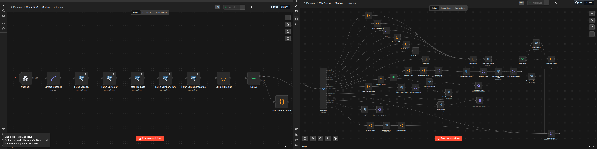

# Arik — WhatsApp AI Support & Sales Bot

> Production AI bot for Waltonmarket.com, a smart home automation business
> in Okara, Punjab, Pakistan. Handles sales, quotations, and customer
> support entirely via WhatsApp — 24/7, zero human needed for routine queries.


---

## The Problem

WaltonMarket receives dozens of WhatsApp inquiries daily for smart home
products and installation quotes. Responding manually was slow,
inconsistent, and unavailable outside business hours.

**Needed:** An intelligent assistant that could handle product queries,
generate custom installation quotes, and escalate to humans only when necessary.

---

## The Solution

A fully automated WhatsApp AI bot built on n8n with Gemini AI,
PostgreSQL, and self-hosted WAHA infrastructure — deployed on Hetzner.

---

## Architecture
```
Customer WhatsApp
       ↓
   WAHA (Self-hosted WhatsApp API — NOWEB engine)
       ↓
   n8n Workflow Engine (Docker)
       ↓
   Gemini 2.5 Flash (Intent Classification + Response Generation)
       ↓
   PostgreSQL (Sessions, Products, Quotations, Orders)
       ↓
   Reply via WAHA → Customer WhatsApp
```

---

## Key Features

| Feature | Details |
|---|---|
| **AI Intent Detection** | 15 intent types classified by Gemini in a single call |
| **Product Search** | Score-based search across 30+ smart home products |
| **Quote Generator** | 3-step room-based pricing flow with discount tiers |
| **Cart System** | Add / remove / clear / checkout |
| **Roman Urdu Support** | Understands mixed Urdu-English naturally |
| **Customer Memory** | Recognizes returning customers, recalls last quote |
| **Escalation System** | 30-min cooldown with clean human handoff |
| **Voice/Media Handling** | Politely rejects non-text with guidance |
| **Campaign Handling** | Filters broadcast/status messages automatically |

---

## Tech Stack

| Layer | Technology |
|---|---|
| Workflow Engine | n8n v2.12.3 (self-hosted, Docker) |
| AI Model | Google Gemini 2.5 Flash (thinkingBudget: 0) |
| WhatsApp API | WAHA (NOWEB engine, self-hosted Docker) |
| Database | PostgreSQL 16 |
| Server | Hetzner VPS — Ubuntu 24.04 |
| Infrastructure | Docker + Docker Compose |

---

## Database Schema (Key Tables)
```sql
sessions     — session_id, quote_state, quote_data, escalated_at
products     — id, name, price, stock, condition, category
quotations   — quote_ref, customer_name, customer_phone, city,
               marlas, stories, subtotal, discount_amount, grand_total
orders       — order_id, customer_id, items, status
customers    — id, phone, name, address, created_at
```

---

## Quotation Pricing Logic

- **Bedroom:** 4-Gang Fan Switch (PKR 7,650) + 2× Wall Socket (6,199) + bulbs
- **Living/Drawing Room:** 4-Gang (4,450) + Fan Switch (4,650) + bulbs
- **Kitchen / Bathroom / Garage:** 2-Gang switch
- **Touch Panel Options:** 4-Gang (14,500) or Alexa-enabled (32,500)
- **Discounts:** >100k = 10% off · >200k = 15% off

---

## What I Learned Building This

- Prompt engineering for structured JSON output from LLMs at production scale
- Stateful multi-step conversation management without a dedicated memory service
- Self-hosting production WhatsApp infrastructure with WAHA (NOWEB engine)
- PostgreSQL session management for complex multi-turn conversation flows
- Docker networking between services (n8n ↔ WAHA ↔ PostgreSQL)
- Debugging async webhook-based systems in real production environment
- Migrating infrastructure mid-production (UltraMsg → WAHA, Supabase → Hetzner)

---

## Setup & Deployment
```bash
# Clone the repo
git clone https://github.com/hassanraza1/arik-whatsapp-bot

# Copy environment variables
cp .env.example .env
# Fill in your values in .env

# Start all services
docker-compose up -d

# Import workflow
# Open n8n → Settings → Import workflow → select workflows/arik-main.json
```

---

## Environment Variables

See `.env.example` for all required variables including:
- `GEMINI_API_KEY`
- `WAHA_API_KEY`
- `DB_HOST`, `DB_USER`, `DB_PASSWORD`, `DB_NAME`

---

## Author

**Muhammad Ain Ul Hassan Raza**
AI Automation Engineer — Okara, Punjab, Pakistan
[GitHub](https://github.com/hassanraza1)
